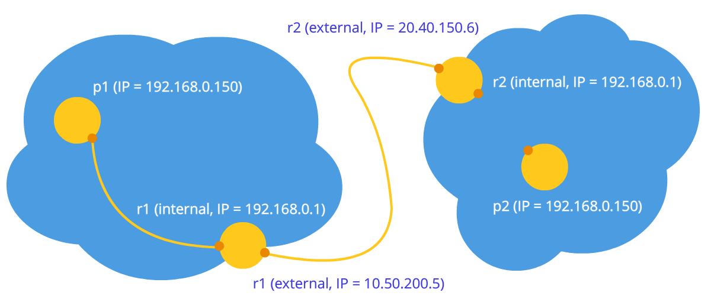
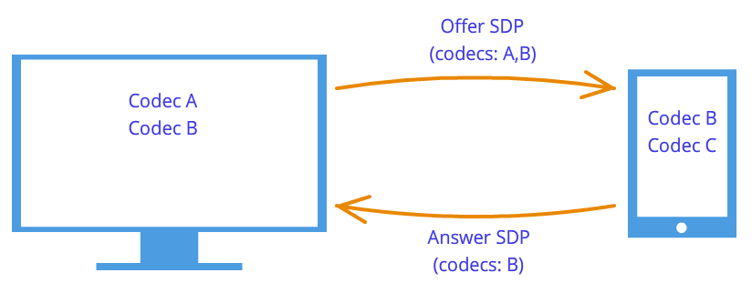

# **WebRTC**

Web Real-Time Communication

---

# What is it?

It allows communicating in real-time directly between browsers (P2P) without any third-party plugins.

It is used for:
- audio/video communication;
- data channels;
- file sharing.

---

# Use cases

The existing use cases for WebRTC can get really diverse. The most promising spheres:

- messengers;
- smart home;
- healthcare;
- wearable devices; 
- Internet of Things.

---

<style>
    section.apps {
        display: flex;
        flex-wrap: wrap;
        flex-direction: row;
        justify-content: space-between;
        align-items: flex-end;
        align-content: flex-start;
    }
    
    section.apps h1 {
        width: 100%;
    }
    
    section.apps p {
        width: 20%;
    }
    
    section.apps p img {
        width: 100%;
    }
</style>

<!-- _class: apps -->
# Who use it?


Google Meet


WhatsApp


FB Messenger


Discord

---

<style>
    section.nat p {
        text-align: center;
    }
    
    section.nat p img {
        height: 400px;
    }
</style>

<!-- _class: nat -->
# Connection establishment


Network address translation

---

<style>
    section.center p {
        text-align: center;
    }
</style>

<!-- _class: center -->
## Both nodes in one network


---

<!-- _class: center -->
## One node in private and one in public network


---

<!-- _class: center -->
## Both nodes in different private networks



---

# Connection setup phase

**WebRTC** has no protocol for transferring connection data. For this purpose additional server (it is called signalling) is needed:

- WebSockets;
- HTTP;
- SMTP.

All data is transmitted as text and is divided into two types - **SDP** and **ICE Candidate**.

---

## Caller steps

1. Getting a local media stream and setting it for transmission
(`getUserMedia`, `addTrack`).
2. Offer to start data transfer (`createOffer`).
3. Getting a local SDP object and passing it through the signaling mechanism (`setLocalDescription`).
4. Getting the local ICE candidate objects and passing them through the signaling mechanism (`onicecandidate`).
5. Receiving a remote media stream (`ontrack`).

---

## Callee steps

1. Getting a local media stream and setting it for transmission
(`getUserMedia`, `addTrack`).
2. Receiving an offer to start data transmission and creating a response (`setRemoteDescription`, `createAnswer`).
3. Getting a local SDP object and passing it through the signaling mechanism (`setLocalDescription`).
4. Getting the local ICE candidate objects and passing them through the signaling mechanism (`onicecandidate`).
5. Receiving a remote media stream (`ontrack`).


---

<style>
    section.entities {
        display: flex;
        justify-content: center;
        align-items: center;
    }
</style>

<!-- _class: entities -->
# Basic entities

---

<style>
    section.ms p {
        margin-top: 100px;
        text-align: center;
    }
</style>

<!-- _class: ms -->
## MediaStream


---

<style>
    section.sdp p {
        text-align: center;
    }
    
    section.sdp p img {
        width: 60%;
    }
</style>

<!-- _class: sdp -->
## Session Description Protocol ([SDP](https://webrtchacks.com/sdp-anatomy/))

 

---

## Interactive Connectivity Establishment (ICE) candidates

ICE lets two peers find and establish a connection with one another in such order:

1. Direct UDP connection.
2. Direct TCP connection, via the HTTP port.
3. Direct TCP connection, via the HTTPS port.
4. Indirect connection via a relay/TURN server.

---

## Types of ICE candidates

```
candidate:3511422883 1 udp 2113937151 47e5106c-1c95-4262-b1cd-e917fb8a51b1.local 60843 typ host generation 0 ufrag 3rtW network-cost 999
```

1. **host**.
2. **srflx**.
3. **prflx**
4. **relay**

---

<!-- _class: center -->


p1 - `[10.50.200.5, 531, udp]` - p2
p2 - `[10.50.150.3, 531, udp]` - p1

---

<!-- _class: center -->


p1 - `[10.50.200.5, 531, udp]` - r1
r1 - `[10.50.200.5, 531, udp]` - p2
p2 - `[10.50.150.3, 531, udp]` - r1
r1 - `[10.50.150.3, 531, udp]` - p1

---

# STUN/TURN servers

<!-- _class: center -->


---

## STUN server operation

1. r1_nat empty table

Internal IP | Internal PORT | External IP | External PORT
---|---|---|---
|||

2. p1 generates package

Src IP | Src PORT | Dest IP | Dest PORT
---|---|---|---
192.168.0.200 | 35777 | 12.62.100.200 |	6000

---

3. r1 changes package

Src IP | Src PORT | Dest IP | Dest PORT
---|---|---|---
10.50.200.5 | 888 |	12.62.100.200 | 6000

r1_nat table

Internal IP | Internal PORT | External IP | External PORT
---|---|---|---
192.168.0.200 | 35777 | 10.50.200.5 | 888

---

4. s1 receives package

Src IP | Src PORT | Dest IP | Dest PORT
---|---|---|---
10.50.200.5 | 888 | 12.62.100.200 | 6000

5. s1 generates an answer

Src IP | Src PORT | Dest IP | Dest PORT | Content
---|---|---|---|---
12.62.100.200 | 6000 | 10.50.200.5 | 888 | 10.50.200.5:888

---

6. r1 receives an answer and choose between ports

Internal IP | Internal PORT | External IP | External PORT
---|---|---|---
192.168.0.200 | 35777 | 10.50.200.5 | 888
192.168.0.173 | 35777 | 10.50.200.5 | 889

7. r1 changes an answer

Src IP | Src PORT | Dest IP | Dest PORT
---|---|---|---
12.62.100.200 | 6000 | 192.168.0.200 | 35777

---

TURN advantages:
- relay mode;
- ability to work with symmetric NAT.

```javascript
new RTCPeerConnection({
  iceServers: [
    {
      urls: 'stun:stun.server.com: 13773',
    },
    {
      urls: 'turn:turn.server.com:19403',
      username: 'user',
      credentials: 'credentials'
    }
  ]
})
```
