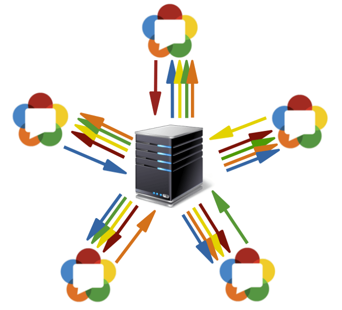
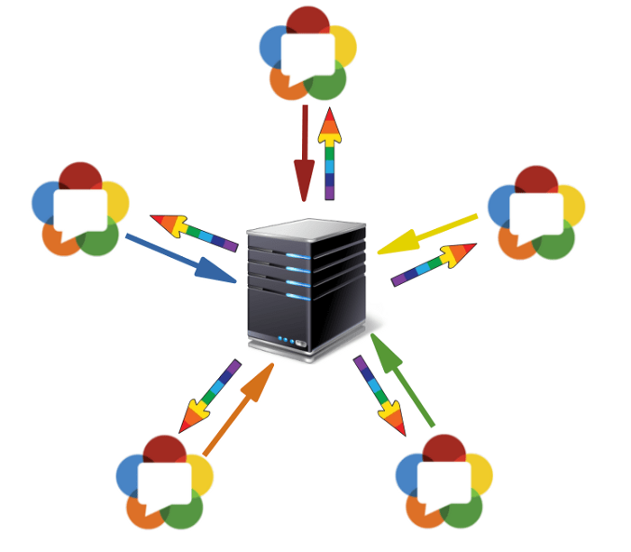

## WebRTC
Web Real-Time Communications – WebRTC in short – is an HTML5 specification that allows you to communicate in real-time directly between browsers without any third-party plugins. WebRTC can be used for multiple tasks (even file sharing) but real-time peer-to-peer audio and video communication is obviously the primary feature and we will focus on those in this article.

What WebRTC does is to allow access to devices – you can use a microphone, a camera and share your screen with help from WebRTC and do all of that in real-time! So, in the simplest way:

> WebRTC enables for audio and video communication to work inside web pages.

### Приложения, использующие WebRTC

**Google Meet**

Google Meet — сервис мгновенного обмена сообщениями, а также проведения видео- и аудиозвонков, выпущенный в 2017 году компанией Google. В браузерах, основанных на Chromium (Google Chrome и др.) используется много скрытых возможностей WebRTC, которые не описаны в документации и периодически появляются первыми в его решениях для Meet (как и в его предшественнике Hangouts). Так было с захватом экрана, размытием фона, поддержкой аппаратного кодирования на некоторых платформах.

**Jitsi Meet**

Jitsi Meet — приложение с открытым исходным кодом, выпущенное компанией 8x8. Технология Jitsi основана на архитектуре Simulcast, что означает нестабильную работу на слабых каналах связи и высокие требования к скорости подключения на стороне сервера. Позволяет проводить веб-конференции только в браузере и не имеет полноценных клиентских приложений для совместной работы, поддержаны конференции с количеством участников не более 75 (до 35 с высоким качеством связи). Для полноценного использования Jitsi в корпоративной среде необходима самостоятельная разработка и установка дополнительного ПО.

**BigBlueButton**

BigBlueButton – это свободное программное обеспечение для видеоконференцсвязи. Особый акцент разработчики делают на дистанционном образовании (присутствуют такие функции как интерактивная доска, показ контента, поддержка опросов и т. п.). Поддерживает веб-конференции до 100 участников.

### Установка соединения

Установить соединение p2p – довольно трудная задача, так как компьютеры не всегда обладают публичными IP адресами, то есть адресами в интернете. Из-за небольшого количества IPv4 адресов (и для целей безопасности) был разработан механизм NAT, который позволяет создавать приватные сети, например, для домашнего использования. Многие домашние роутеры сейчас поддерживают NAT и благодаря этому все домашние устройства имеют выход в интернет, хотя провайдеры интернета обычно предоставляют один IP адрес. Публичные IP адреса - уникальны в интернете, а приватные нет. Поэтому соединиться p2p - трудно.
Для того, чтобы понять это лучше, рассмотрим три ситуации: оба узла находятся в одной сети (Рисунок 1), оба узла находятся в разных сетях (один в приватной, другой в публичной) (Рисунок 2) и оба узла находятся в разных приватных сетях с одинаковыми IP адресами (Рисунок 3).

На рисунках выше первая буква в дву-символьных обозначениях означает тип узла (p = peer, r = router). На первом рисунке ситуация благоприятная: узлы в своей сети вполне идентифицируются сетевыми IP адресами и поэтому могут подключаться к друг другу напрямую. На втором рисунке имеем две разные сети, у которых похожие нумерации узлов. Здесь появляются маршрутизаторы (роутеры), у которых есть два сетевых интерфейса – внутри своей сети и вне своей сети. Поэтому у них два IP адреса. Обычные узлы имеют только один интерфейс, через который они могут общаться только в своей сети. Если они передают данные кому-то вне своей сети, то только с помощью NAT внутри маршрутизатора (роутера) и поэтому видимы для других под IP адресом роутера – это их внешний IP адрес. Таким образом, у узла p1 есть внутренний IP = 192.168.0.200 и внешний IP = 10.50.200.5, причем последний адрес будет внешним также и для всех других узлов в его сети1. Похожая ситуация и для узла p2. Поэтому их связь невозможна, если использовать только их внутренние (свои) IP адреса. Можно воспользоваться внешними адресами, то есть адресами роутеров, но, так как у всех узлов в одной приватной сети один и тот же внешний адрес, то это довольно затруднительно. Это проблема решается с помощью механизма NAT

Что же будет, если мы все-таки решим соединить узлы через их внутренние адреса? Данные не выйдут за пределы сети. Для усиления эффекта можно представить ситуацию, изображенную на последнем рисунке – у обоих узлов совпадают внутренние адреса. Если они будут использовать их для коммуникации, то каждый узел будет общаться с самим собой.

WebRTC успешно справляется с такими проблемами, используя протокол ICE, который, правда, требует использования дополнительных серверов (STUN, TURN). Обо всем этом ниже.

### Две фазы WebRTC
Чтобы соединить два узла через протокол WebRTC необходимо провести некие предварительные действия для установления соединения. Это первая фаза – установка соединения. Вторая фаза – передача видео-данных.

Сразу стоит сказать, что, хоть технология WebRTC в своей работе использует множество различных способов коммуникации (TCP и UDP) и имеет гибкое переключение между ними, эта технология не имеет протокола для передачи данных о соединении. Не удивительно, ведь подключить два узла p2p не так-то просто. Поэтому необходимо иметь некоторый дополнительный способ передачи данных, никак не связанный с WebRTC. Это может быть сокетная передача, протокол HTTP, это может быть даже протокол SMTP. Этот механизм передачи начальных данных называется сигнальным. Передавать нужно не так много информации. Все данные передаются в виде текста и делятся на два типа – SDP и Ice Candidate. Первый тип используется для установления логического соединения, а второй для физического3. Подробно обо всем этом позже, а пока лишь важно помнить, что WebRTC даст нам некую информацию, которую нужно будет передать другому узлу. Как только мы передадим всю нужную информацию, узлы смогут соединиться и больше наша помощь нужна не будет. Таким образом, сигнальный механизм, который мы должны реализовать отдельно, будет использоваться только при подключении, а при передаче видео-данных использоваться не будет.

Итак, рассмотрим первую фазу – фазу установки соединения. Она состоит из нескольких пунктов. Рассмотрим эту фазу сначала для узла, который инициирует соединение, а потом для ожидающего.

**Инициатор (звонящий – caller):**
1. Получение локального (своего) медиа потока и установка его для передачи (`getUserMediaStream`)
2. Предложение начать передачу данных (`createOffer`)
3. Получение своего SDP объекта и передача его через сигнальный механизм (`SDP`)
4. Получение своих Ice candidate объектов и передача их через сигнальный механизм (`Ice candidate`)
5. Получение удаленного (чужого) медиа потока и отображение его на экране (`onAddStream`)

**Ожидающий звонка (callee):**
1. Получение локального (своего) медиа потока и установка его для передачи (`getUserMediaStream`)
2. Получение предложения начать видео-передачу данных и создание ответа (`createAnswer`)
3. Получение своего SDP объекта и передача его через сигнальный механизм (`SDP`)
4. Получение своих Ice candidate объектов и передача их через сигнальный механизм (`Ice candidate`)
5. Получение удаленного (чужого) медиа потока и отображение его на экране (`onAddStream`)

Несмотря на кажущуюся запутанность шагов здесь их на самом деле три: отправка своего медиа потока (п.1), установка параметров соединения (пп.2-4), получение чужого медиа потока (п.5). Самый сложный – второй шаг, потому что он состоит из двух частей: установление **физического** и **логического** соединения. Первое соединение указывает путь, по которому должны идти пакеты, чтобы дойти от одного узла сети до другого. Второе указывает параметры видео/аудио – какое использовать качество, какие использовать кодеки.

Мысленно этап `createOffer` или `createAnswer` следует соединить с этапами передачи `SDP` и `Ice candidate` объектов.

Далее будут рассмотрены некоторые сущности подробнее, а именно – медиапоток (**MediaStream**), дескриптор сессии (**SDP**) и кандидаты (**Ice candidate**).

### Основные сущности

#### Медиа потоки (MediaStream)

Основной сущностью является медиа поток, то есть поток видео и аудио данных, картинка и звук. Медиа потоки бывают двух типов – локальные и удаленные. Локальный получает данные от устройств входа (камера, микрофон), а удаленный по сети. Таким образом у каждого узла есть и локальный, и удаленный поток. В WebRTC для потоков существует интерфейс MediaStream и также существует подинтерфейс LocalMediaStream специально для локального потока. В JavaScript можно столкнуться только с первым.

В WebRTC существует довольно запутанная иерархия внутри потока. Каждый поток может состоять из нескольких медиа дорожек (MediaTrack), которые в свою очередь могут состоять из нескольких медиа каналов (MediaChannel). Да и самих медиа потоков может быть тоже несколько.

#### Дескриптор сессии (SDP)

У разных компьютеров всегда будут разные камеры, микрофоны, видеокарты и прочее оборудование. Существует множество параметров, которыми они обладают. Все это необходимо скоординировать для медиа передачи данных между двумя узлами сети. WebRTC делает это автоматически и создает специальный объект – дескриптор сессии SDP. Передайте этот объект другому узлу, и можно передавать медиа данные. Только связи с другим узлом пока нет5.

Для этого используется любой сигнальный механизм. SDP можно передать с помощью любого удобного протокола (HTTP, WebSocket, etc.). Всё очень просто – Вам дадут уже готовый SDP и его нужно переслать. А при получении на другой стороне – передать в ведомство WebRTC. Дескриптор сессии хранится в виде текста и его можно изменить в своих приложениях, но, как правило, это не нужно. Как пример, при соединении десктоп↔телефон иногда требуется принудительно выбирать нужный аудио кодек.

Обычно при установке соединения необходимо указывать какой-то адрес, например URL. Здесь в этом нет необходимости, так как через сигнальный механизм Вы сами отправите данные по назначению. Чтобы указать WebRTC, что мы хотим установить p2p соединение нужно вызвать функцию createOffer. После вызова этой функции и указания ей специального callback‘a будет создан SDP объект и передан в этот же callback. Все, что от Вас требуется – передать этот объект по сети другому узлу (собеседнику). После этого на другом конце через сигнальный механизм придут данные, а именно этот SDP объект. Этот дескриптор сессии для этого узла чужой и поэтому несет полезную информацию. Получение этого объекта – сигнал к началу соединения. Поэтому Вы должны согласиться на это6 и вызвать функцию createAnswer. Она – полный аналог createOffer. Снова в Ваш callback передадут локальный дескриптор сессии и его нужно будет передать по сигнальному механизму обратно.

Стоит отметить, что вызывать функцию createAnswer можно только после получения чужого SDP объекта. Почему? Потому что локальный SDP объект, который будет генерироваться при вызове createAnswer, должен опираться на удаленный SDP объект. Только в таком случае возможно скоординировать свои настройки видео с настройками собеседника. Также не стоит вызывать createAnswer и createOffer до получения локального медиа потока – им будет нечего писать в SDP объект7.

Так как в WebRTC есть возможность редактирования SDP объекта, то после получения локального дескриптора его нужно установить. Это может показаться немного странным, что нужно передавать WebRTC то, что она сама нам дала, но таков протокол. При получении удаленного дескриптора его нужно тоже установить. Поэтому Вы должны на одном узле установить два дескриптора – свой и чужой (то есть локальный и удаленный).

После такого рукопожатия узлы знают о пожеланиях друг друга. Например, если узел 1 поддерживает кодеки A и B, а узел 2 поддерживает кодеки B и C, то, так как каждый узел знает свой и чужой дескрипторы, оба узла выберут кодек B (Рисунок 7). Логика соединения теперь установлена, и можно передавать медиа потоки, но есть другая проблема – узлы по-прежнему связаны лишь сигнальным механизмом.

#### Кандидаты (Ice candidate)

Технология WebRTC пытается запутать нас своей новой методологией. При установке соединения не указывается адрес того узла, с которым нужно соединиться. Устанавливается сначала логическое соединение, а не физическое, хотя всегда делалось наоборот8. Но это не покажется странным, если не забывать, что мы используем сторонний сигнальный механизм.

Итак, соединение уже установлено (логическое соединение), но пока нет пути, по которому узлы сети могут передавать данные. Здесь не всё так просто, но начнем с простого. Пусть узлы находятся в одной приватной сети. Как мы уже знаем, они могут легко соединяться друг с другом по своим внутренним IP адресам (или быть может, по каким-то другим, если используется не TCP/IP).

Через callback `onicecandidate` WebRTC сообщает нам Ice candidate объекты. Они тоже приходят в текстовой форме и также, как с дескрипторами сессии, их нужно просто переслать через сигнальный механизм. Если дескриптор сессии содержал информацию о наших установках на уровне камеры и микрофона, то кандидаты содержат информацию о нашем расположении в сети. Передайте их другому узлу, и тот сможет физически соединиться с нами, а так как у него уже есть и дескриптор сессии, то и логически сможет соединиться и данные «потекут». Если он не забудет отправить нам и свой объект кандидата, то есть информацию о том, где находится он сам в сети, то и мы сможем с ним соединиться. Заметим здесь еще одно отличие от классического клиент-серверного взаимодействия. Общение с HTTP сервером происходит по схеме запрос-ответ, клиент отправляет данные на сервер, тот обрабатывает их и шлет по адресу, указанному в пакете запроса. В WebRTC необходимо знать два адреса и соединять их с двух сторон.

Различие от дескрипторов сессии состоит в том, что устанавливать нужно только удаленных кандидатов. Редактирование здесь запрещено и не может принести никакой пользы. В некоторых реализациях WebRTC кандидатов необходимо устанавливать только после установки дескрипторов сессии9.

А почему дескриптор сессии был один, а кандидатов может быть много? Потому что расположение в сети может определяться не только своим внутренним IP адресом, но также и внешним адресом маршрутизатора, и не обязательно одного, а также адресами TURN серверов. Остаток параграфа будет посвящен подробному рассмотрению кандидатов и тому, как соединять узлы из разных приватных сетей.

Итак, два узла находятся в одной сети (Рисунок 8). Как их идентифицировать? С помощью IP адресов. Больше никак. Правда, еще можно использовать разные транспорты (TCP и UDP) и разные порты. Это и есть та информация, которая содержится в объекте кандидата – IP, PORT, TRANSPORT и какая-то другая. Пусть, для примера, используется UDP транспорт и 531 порт.

Тогда, если мы находимся в узле p1, то WebRTC передаст нам такой объект кандидата — `[10.50.200.5, 531, udp]`. Здесь приводится не точный формат, а лишь схема. Если мы в узле p2, то кандидат таков – `[10.50.150.3, 531, udp]`. Через сигнальный механизм p1 получит кандидата p2 (то есть расположение узла p2, а именно его IP и PORT). После чего p1 может соединиться с p2 напрямую. Более правильно, p1 будет посылать данные на адрес 10.50.150.3:531 в надежде, что они дойдут до p2. Не важно, принадлежит ли этот адрес узлу p2 или какому-то посреднику. Важно лишь то, что через этот адрес данные будут посылаться и могут достигнуть p2.

Пока узлы в одной сети – все просто и легко – каждый узел имеет только один объект кандидата (всегда имеется в виду свой, то есть свое расположение в сети). Но кандидатов станет гораздо больше, когда узлы будут находится в разных сетях.

Перейдем к более сложному случаю. Один узел будет находиться за роутером (точнее, за NAT), а второй узел будет находиться в одной сети с этим роутером (например, в интернете).

Этот случай имеет частное решение проблемы, которое мы сейчас и рассмотрим. Домашний роутер обычно содержит таблицу NAT. Это специальных механизм, разработанный для того, чтобы узлы внутри приватной сети роутера смогли обращаться, например, к веб-сайтам.

Предположим, что веб-сервер соединен с интернетом напрямую, то есть имеет публичный IP адрес. Пусть это будет узел p2. Узел p1 (веб-клиент) шлет запрос на адрес 10.50.150.3. Сначала данные попадают на роутер r1, а точнее на его внутренний интерфейс 192.168.0.1. После чего, роутер запоминает адрес источника (адрес p1) и заносит его в специальную таблицу NAT, затем изменяет адрес источника на свой(p1 → r1). Далее, по своему внешнему интерфейсу роутер пересылает данные непосредственно на веб‑сервер p2. Веб-сервер обрабатывает данные, генерирует ответ и отправляет обратно. Отправляет роутеру r1, так как именно он стоит в обратном адресе (роутер подменил адрес на свой). Роутер получает данные, смотрит в таблицу NAT и пересылает данные узлу p1. Роутер выступает здесь как посредник.

А что если несколько узлов из внутренней сети одновременно обращаются к внешней сети? Как роутер поймет кому отправлять ответ обратно? Эта проблема решается с помощью портов. Когда роутер подменяет адрес узла на свой, он также подменяет и порт. Если два узла обращаются к интернету, то роутер подменяет их порты источников на разные. Тогда, когда пакет от веб‑сервера придет обратно к роутеру, то роутер поймет по порту, кому назначен данный пакет. Пример ниже.

Вернемся к технологии WebRTC, а точнее, к ее части, которая использует ICE протокол (отсюда и Ice кандидаты). Узел p2 имеет одного кандидата (свое расположение в сети – 10.50.150.3), а узел p1, который находится за роутером с NAT, будет иметь двух кандидатов – локального (192.168.0.200) и кандидата роутера (10.50.200.5). Первый не пригодится, но он, тем не менее, генерируется, так как WebRTC еще ничего не знает об удаленном узле – он может находиться в той же сети, а может и нет. Второй кандидат пригодится, и, как мы уже знаем, важную роль будет играть порт (чтобы пройти через NAT).

Запись в таблице NAT генерируется только когда данные выходят из внутренней сети. Поэтому узел p1 должен первым передать данные и только после этого данные узла p2 смогут добраться до узла p1.

На практике оба узла будут находиться за NAT. Чтобы создать запись в таблице NAT каждого роутера, узлы должны что-то отправить удаленному узлу, но на этот раз ни первый не может добраться до второго, ни наоборот. Это связано с тем, что узлы не знают своих внешних IP адресов, а отправлять данные на внутренние адреса бессмысленно.

Однако, если внешние адреса известны, то соединение будет легко установлено. Если первый узел отошлет данные на роутер второго узла, то роутер их проигнорирует, так как его таблица NAT пока пуста. Однако в роутере первого узла в таблице NAT появилась нужна запись. Если теперь второй узел отправит данные на роутер первого узла, то роутер их успешно передаст первому узлу. Теперь и таблица NAT второго роутера имеет нужны данные.

Проблема в том, что, чтобы узнать своей внешний IP адрес, нужен узел находящийся в общей сети. Для решения такой проблемы используются дополнительные сервера, которые подключены к интернету напрямую. С их помощью также создаются заветные записи в таблице NAT.

#### STUN и TURN сервера

При инициализации WebRTC необходимо указать доступные STUN и TURN сервера, которые мы в дальнейшем будем называть ICE серверами. Если сервера не будут указаны, то соединиться смогут только узлы в одной сети (подключенные к ней без NAT). Сразу стоит отметить, что для 3g-сетей обязательно использование TURN серверов.

STUN сервер – это просто сервер в интернете, который возвращает обратный адрес, то есть адрес узла отправителя. Узел, находящий за роутером, обращается к STUN серверу, чтобы пройти через NAT. Пакет, пришедший к STUN серверу, содержит адрес источника – адрес роутера, то есть внешний адрес нашего узла. Этот адрес STUN сервер и отправляет обратно. Таким образом, узел получает свой внешний IP адрес и порт, через который он доступен из сети. Далее, WebRTC с помощью этого адреса создает дополнительного кандидата (внешний адрес роутера и порт). Теперь в таблице NAT роутера есть запись, которая пропускает к нашему узлу пакеты, отправленные на роутер по нужному порту.

Рассмотрим этот процесс на примере.

STUN сервер будем обозначать через s1. Роутер, как и раньше, через r1, а узел – через p1. Также необходимо будет следить за таблицей NAT – ее обозначим как r1_nat. Причем в этой таблице обычно содержится много записей от разный узлов подсети – они приводиться не будут.

Итак, в начале имеем пустую таблицу r1_nat.

Internal IP | Internal PORT | External IP | External PORT
---|---|---|---
|||
	 	 	 
Таблица 1: Пустая таблица NAT. Она задает отображение первых двух столбцов на два последних, то есть каждой паре (IP, PORT), которая адресует узел во внутренней приватной сети, сопоставляется пара (IP, PORT) из внешней публичной сети.

Узел p1 отправляет пакет узлу s1 (STUN серверу). Ниже в таблице указаны четыре интересующие нас поля в заголовке транспортного пакета (TCP или UDP) – IP и PORT источника и приемника. Пусть адреса будут такими:

Src IP | Src PORT | Dest IP | Dest PORT
---|---|---|---
192.168.0.200 | 35777 | 12.62.100.200 |	6000

Таблица 2: Заголовок пакета

Узел p1 отправляет этот пакет роутеру r1 (не важно каким образом, в разных подсетях могут быть использованы разные технологии). Роутеру необходимо сделать подмену адреса источника Src IP, так как указанный в пакете адрес заведомо не подойдет для внешней подсети, более того, адреса из такого диапазона зарезервированы, и ни один адрес в интернете не имеет такого адреса. Роутер делает подмену в пакете и создает новую запись в своей таблице r1_nat. Для этого ему нужно придумать номер порта. Напомним, что, так как несколько узлов внутри подсети могут обращаться к внешней сети, то в таблице NAT должна храниться дополнительная информация, чтобы роутер смог определить, кому из этих нескольких узлов предназначается обратный пакет от сервера. Пусть роутер придумал порт 888.

Измененный заголовок пакета:

Src IP | Src PORT | Dest IP | Dest PORT
---|---|---|---
10.50.200.5 | 888 |	12.62.100.200 | 6000

Таблица 3: Роутер подменил адрес источника на свой. 10.50.200.5 – это внешний адрес роутера.

Таблица r1_nat:

Internal IP | Internal PORT | External IP | External PORT
---|---|---|---
192.168.0.200 | 35777 | 10.50.200.5 | 888

Таблица 4: Таблица NAT пополнилась новой записью

Здесь IP адрес и порт для подсети абсолютно такие же, как у исходного пакета. В самом деле, при обратной передаче мы должны иметь способ полностью их восстановить. IP адрес для внешней сети – это адрес роутера, а порт изменился на придуманный роутером.

Настоящий порт, на который узел p1 принимает подключение – это, разумеется, 35777, но сервер шлет данные на фиктивный порт 888, который будет изменен роутером на настоящий 35777.

Итак, роутер подменил адрес и порт источника в заголовке пакета и добавил запись в таблицу NAT. Теперь пакет отправляется по сети серверу, то есть узлу s1. На входе, s1 имеет такой пакет:

Src IP | Src PORT | Dest IP | Dest PORT
---|---|---|---
10.50.200.5 | 888 | 12.62.100.200 | 6000

Таблица 5: STUN сервер получил пакет

Итого, STUN сервер знает, что ему пришел пакет от адреса 10.50.200.5:888. Теперь этот адрес сервер отправляет обратно. Здесь стоит остановиться и еще раз посмотреть, что мы только что рассматривали. Таблицы, приведенные выше – это кусочек из заголовка пакета, вовсе не из его содержимого. О содержимом мы не говорили, так как это не столь важно – оно как-то описывается в протоколе STUN. Теперь же мы будем рассматривать помимо заголовка еще и содержимое. Оно будет простым и содержать адрес роутера – 10.50.200.5:888, хотя взяли мы его из заголовка пакета. Такое делается не часто, обычно протоколам не важна информация об адресах узлов, важно лишь, чтобы пакеты доставлялись по назначению. Здесь же мы рассматриваем протокол, который устанавливает путь между двумя узлами.

Итак, теперь у нас появляется второй пакет, который идет в обратном направлении:

Src IP | Src PORT | Dest IP | Dest PORT
---|---|---|---
12.62.100.200 | 6000 | 10.50.200.5 | 888

Таблица 6: STUN сервер отправляет пакет с таким заголовком. Заголовок изменился очень просто – источник и приемник поменялись местами, что логично, так как направление пакета теперь другое.

| Content |
|---|
| 10.50.200.5:888 |

Таблица 7: STUN сервер отправляет пакет с таким содержимым

Это уже содержание пакета. На самом деле, оно может содержать много информации, но здесь указано лишь то, что важно для понимания работы STUN сервера.

Далее, пакет путешествует по сети, пока не окажется на внешнем интерфейсе роутера r1. Роутер понимает, что пакет предназначен не ему. Как он это понимает? Это можно узнать только по порту. Порт 888 он не использует для своих личных целей, а использует для механизма NAT. Поэтому в эту таблицу роутер и смотрит. Смотрит на столбец External PORT и ищет строку, которая совпадет с Dest PORT из пришедшего пакета, то есть 888.

Internal IP | Internal PORT | External IP | External PORT
---|---|---|---
192.168.0.200 | 35777 | 10.50.200.5 | 888

Таблица 8: Таблица NAT

Нам повезло, такая строчка существует. Если бы не повезло, то пакет бы просто отбросился. Теперь нужно понять, кому из узлов подсети надо отправлять этот пакет. Не стоит торопиться, давайте снова вспомним о важности портов в этом механизме. Одновременно два узла в подсети могли бы отправлять запросы во внешнюю сеть. Тогда, если для первого узла роутер придумал порт 888, то для второго он бы придумал порт 889. Предположим, что так и случилось, то есть таблица r1_nat выглядит так:

Internal IP | Internal PORT | External IP | External PORT
---|---|---|---
192.168.0.200 | 35777 | 10.50.200.5 | 888
192.168.0.173 | 35777 | 10.50.200.5 | 889

Таблица 9: Таблица NAT

По порту `888` понятно, что нужный внутренний адрес это `192.168.0.200:35777`. Роутер заменяет адрес приемника с

Src IP | Src PORT | Dest IP | Dest PORT
---|---|---|---
12.62.100.200 | 6000 | 10.50.200.5 | 888

Таблица 10: Роутер подменяет адрес приемника

На

Src IP | Src PORT | Dest IP | Dest PORT
---|---|---|---
12.62.100.200 | 6000 | 192.168.0.200 | 35777

Таблица 11: Роутер подменил адрес приемника

Пакет успешно приходит к узлу p1 и, посмотрев на содержимое пакета, узел узнает о своем внешнем IP адресе, то есть об адресе роутера во внешней сети. Также он знает и порт, который роутер пропускает через NAT.

Что же дальше? Какая от этого всего польза? Польза – это запись в таблице r1_nat. Если теперь кто угодно будет отправлять на роутер r1 пакет с портом 888, то роутер перенаправит этот пакет узлу p1. Таким образом, создался небольшой узкий проход к спрятанному узлу p1.

Из примера выше можно получить некоторое представление о работе NAT и сути STUN сервера. Вообще, механизм ICE и STUN/TURN сервера как раз и направлены на преодоления ограничений NAT.

Между узлом и сервером может стоять не один роутер, а несколько. В таком случае узел получит адрес того роутера, который является первым выходящим в ту же сеть, что и сервер. Иными словами, получим адрес роутера, подключенного к STUN серверу. Для p2p коммуникации это как раз то, что нам нужно, если не забыть тот факт, что в каждом роутере добавится необходимая нам строчка в таблицу NAT. Поэтому обратный путь будет вновь так же гладок.

TURN сервер – это улучшенный STUN сервер. Отсюда сразу следует извлечь, что любой TURN сервер может работать и как STUN сервер. Однако, есть и преимущества. Если p2p коммуникация невозможна (как например, в 3g сетях), то сервер переходит в режим ретранслятора (relay), то есть работает как посредник. Разумеется, ни о каком p2p тогда речь не идет, но за рамками механизма ICE узлы думают, что общаются напрямую.

В каких случаях необходим TURN сервер? Почему не хватает STUN сервера? Дело в том, что существует несколько разновидностей NAT. Они одинаково подменяют IP адрес и порт, однако в некоторые из них встроена дополнительная защита от “фальсификации”. Например, в симметричной таблице NAT сохраняются еще 2 параметра - IP и порт удаленного узла. Пакет из внешней сети проходит через NAT во внутреннюю сеть только в том случае, если адрес и порт источника совпадают с записанными в таблице. Поэтому фокус со STUN сервером не удается - таблица NAT хранит адрес и порт STUN сервера и, когда роутер получает пакет от WebRTC собеседника, он его отбрасывает, так как он “фальсифицирован”. Он пришел не от STUN сервера.

Таким образом TURN сервер нужен в том случае, когда оба собеседника находятся за симметричным NAT (каждый за своим).

### Кодеки в WebRTC

Кодеки WebRTC можно разделить на обязательные (браузеры, реализующие данную технологию должны их поддерживать) и дополнительные (не включённые в стандарт, но добавленные некоторыми браузерами).

#### Аудиокодеки

Для сжатия аудиотрафика в WebRTC используются обязательные кодеки (Opus и G.711) и дополнительные (G.722, iLBC, iSAC).

**Opus** — это аудиокодек с низкой задержкой кодирования (от 2.5 мс до 60 мс), поддержкой переменного битрейта и высоким уровнем сжатия, что идеально подходит для передачи потокового аудиосигнала в сетях с переменной пропускной способностью. Является основным аудиокодеком для WebRTC. Opus — гибридное решение, сочетающее в себе лучшие характеристики кодеков SILK (компрессия голоса, устранение искажений человеческой речи) и CELT (кодирование аудиоданных). Кодек находится в свободном доступе, разработчикам, которые его используют, не нужно платить отчисления правообладателям. По сравнению с другими аудиокодеками, Opus, несомненно, выигрывает по множеству показателей. По ряду параметров он превосходит довольно популярные кодеки с низким битрейтом, такие, как MP3, Vorbis, AAC LC. Opus восстанавливает наиболее приближенную к оригиналу “картину” звука, чем AMR-WB и Speex.

**G.711** — устаревший голосовой кодек с высоким битрейтом (64 kbps), который чаще всего применяется в системах традиционной телефонии. Основным достоинством является минимальная вычислительная нагрузка из-за использования лёгких алгоритмов сжатия. Кодек отличается низким уровнем компрессии голосовых сигналов и не вносит дополнительной задержки звука во время общения между пользователями.

G.711 поддерживается большим количеством устройств. Системы, в которых используется этот кодек, более легкие в применении, чем те, которые основаны на других аудиокодеках (G.723, G.726, G.728 и т.д.). По качеству G.711 получил оценку 4.2 в тестировании MOS (оценка в пределах 4-5 является самой высокой и означает хорошее качество, аналогичное качеству передачи голосового трафика в ISDN и даже выше).

**G.722** — является стандартом ITU-T, принят в 1988 году, в настоящее время является бесплатным. Может работать со скоростью 48, 56 и 64 кбит/с, обеспечивая качество звука на уровне G.711. И аналогично G.711 является устаревшим. Поддерживается в Chrome, Safari и Firefox.

**iLBC** (internet Low Bitrate Codec) — узкополосный речевой кодек с открытым исходным кодом. Доступен в Chrome и Safari. Из-за высокого сжатия потока при использовании данного кодека возрастает нагрузка на процессор.

**iSAC** (internet Speech Audio Codec) — широкополосный речевой аудиокодек, ранее проприетарный, который в настоящее время является частью проекта WebRTC, тем не менее не обязателен для использования. Поддерживается в Chrome и Safari. В реализации для WebRTC используется адаптивный битрейт от 10 до 52 кбит/с с частотой дискретизации 32 kHz.

#### Видеокодеки

Вопросы выбора видеокодека для WebRTC заняли у разработчиков несколько лет, в итоге в стандарт вошли VP8 и H.264. Также существуют реализации необязательных видеокодеков (H.265, VP9, AV1).

**VP8** — свободный видеокодек с открытой лицензией, отличается высокой скоростью декодирования видеопотока и повышенной устойчивостью к потере кадров. Кодек универсален, его легко внедрить в аппаратные платформы, поэтому очень часто разработчики систем видеоконференцсвязи используют его в своих продуктах. Совместим с браузерами Chrome, Edge, Firefox и Safari (12.1+).

Платный видеокодек **H.264** стал известен намного раньше своего собрата. Это кодек с высокой степенью сжатия видеопотока при сохранении высокого качества видео. Широкая распространенность этого кодека среди аппаратных систем видеоконференцсвязи предполагает его использование в стандарте WebRTC. Совместим с браузерами Chrome (52+), Edge, Firefox (в версиях 68+ для Android поддержка была прекращена) и Safari.

**VP9** — открытый и бесплатный стандарт сжатия видео, разработанный в 2012 году компанией Google. Является развитием идей, заложенных в VP8 и в последующем был расширен в рамках AV1. Совместим с браузерами Chrome (48+) и Firefox.

**H.265** — платный видеокодек, являющийся преемником H.264, обеспечивающий такое же визуальное качество при вдвое меньшем битрейте. Это достигается с помощью более эффективных алгоритмов сжатия. В настоящее время этот кодек конкурирует с бесплатным AV1.

**AV1** — открытый кодек для сжатия видео, разработанный специально для передачи видео по сети Интернет. Поддерживается в Chrome (70+) и Firefox (67+).

### WebRTC Topologies

The peer-to-peer (mesh) topology is the only connection type that is covered in the WebRTC specification. However, there are many use cases where a mesh topology is insufficient. Server based topologies can help address these drawbacks and are often used within the world of WebRTC for transferring media. The best topology for any given application depends largely on the expected use cases, as each one has its own unique set of benefits and drawbacks.

**Mesh**

In a peer-to-peer or mesh topology, each participant in a session directly connects to all other participants without the use of a server. This type of connection is perfect for small video conferences as it is the lowest cost and easiest to set up. However, when conferences grow, maintaining direct connections between all participants becomes unsustainable as it can become too CPU intensive. Since the connections are direct between peers, a mesh topology doesn’t lend itself well to recording.

For these reasons, a mesh topology is best for simple applications that connect 2 to 3 participants, where low latency is important, and where recording isn’t required.

**Selective Forwarding (SFU)**

In a selective forwarding topology, each participant in a session connects to a server which acts as a selective forwarding unit (SFU). Each participant uploads their encrypted video stream one time to the server. The server then forwards those streams to each of the other participants. This reduces latency and also permits things like transcoding, recording, and other server-side integrations such as SIP which would be much more difficult in a peer-to-peer connection.

The topology is not without its limits. While having a single upstream connection makes it more upload-efficient than a mesh topology, having multiple downstream connections means  each client will eventually run out of resources once a certain number of participants is active in the session.

For these reasons, a selective forwarding topology is best for applications that connect 4 to 10 participants, where low latency is important, or where recording is required and integrity is critical. This topology is generally considered the most balanced.

**Multipoint Control (Mixing)**

In a multipoint control topology, each participant in a session connects to a server which acts as a multipoint control unit (MCU). The MCU receives media from each participant and decodes it, mixing the audio and video from the participants together into a single stream which is in turn encoded and sent to each participant. This requires less bandwidth usage and device CPU but it does require additional server CPU for mixing audio/video into single streams. MCU’s are also a great option for dealing with poor network conditions as it provides the lowest possible bandwidth usage for each individual participant.

For these reasons, a multipoint control topology is best for large-scale applications that connect large numbers of participants, or poor network conditions, or where recording is required and integrity is critical.

#### Comparison between a mesh network and a star network

Discrete graph over the CPU usage measured in percentages for the two networks

Discrete graph over the bit rate measured in Mbit/s for the two networks

### WebRTC Security

**Browser Protection**

As we already know, WebRTC is enacted directly between browsers without the need for plugins. This makes WebRTC inherently safer, because it provides an extra level of protection against malware or other undesirable software installations that may be disguised as a plug-in. Further, because WebRTC is offered as a part of a browser, any potential security threats or vulnerabilities tend to be addressed quickly via auto-updates from the browser vendors.

**Media Access**

The WebRTC specification has addressed potential concerns to allowing access media resources by requiring explicit permission for the camera or microphone to be used. It is not possible for a WebRTC application to gain access to a device without consent. Furthermore, whenever a device is in use, it will be indicated in the clients UI and on their hardware.

**Encryption**

Encryption is mandatory part of WebRTC and is enforced on all parts of establishing and maintaining a connection.The preferred method for this is to use perfect forward secrecy (PFS) ciphers in a DTLS (Datagram Transport Layer Security) handshake to securely exchange key data. For audio and video, key data can then be used to generate AES (Advanced Encryption Standard) keys which are in turn used by SRTP (Secure Real-time Transport Protocol) to encrypt and decrypt the media.This acronym-rich stack of technologies translates to extremely secure connections that are impossible to break with current technology. Both WebRTC and ORTC mandate this particular stack, which is backwards-compatible and interoperable with VoIP systems.

### adapter.js

While the WebRTC specification is relatively stable, not all browsers have fully implemented all of its features. In addition, some browsers still have prefixes on some or all WebRTC APIs. While you can manually code around these issues, there is an easier way. The WebRTC organization provides on GitHub the WebRTC adapter to work around compatibility issues in different browsers' WebRTC implementations. The adapter is a JavaScript shim which lets your code to be written to the specification so that it will "just work" in all browsers with WebRTC support. There's no need to conditionally use prefixed APIs or implement other workarounds.

For each version of each browser that supports WebRTC, adapter.js implements the needed polyfills, establishes the non-prefixed names of APIs, and applies any other changes needed to make the browser run code written to the WebRTC specification.

For example, on Firefox versions older than 38, the adapter adds the RTCPeerConnection.urls property; Firefox doesn't natively support this property until Firefox 38, while on Chrome, the adapter adds support for the Promise based API is added if it's not present. These are just a couple of examples; there are of course other adjustments made for you by the shim.

The WebRTC adapter currently supports Mozilla Firefox, Google Chrome, Apple Safari, and Microsoft Edge.

### Useful links

https://www.w3.org/TR/webrtc/
